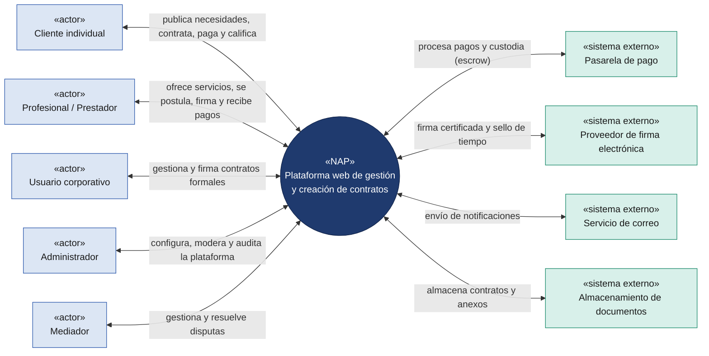
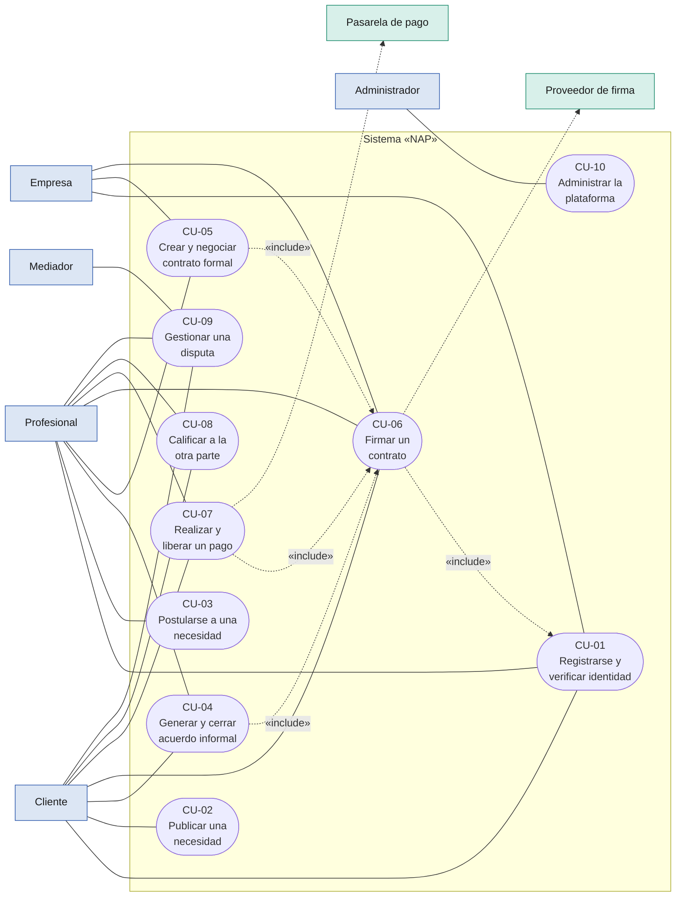
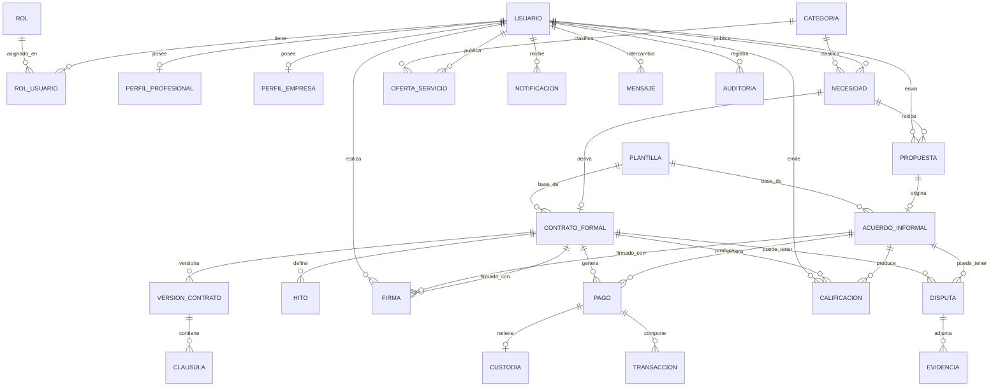
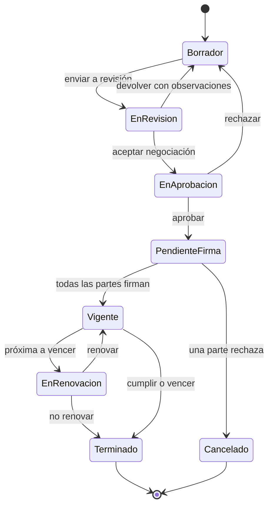
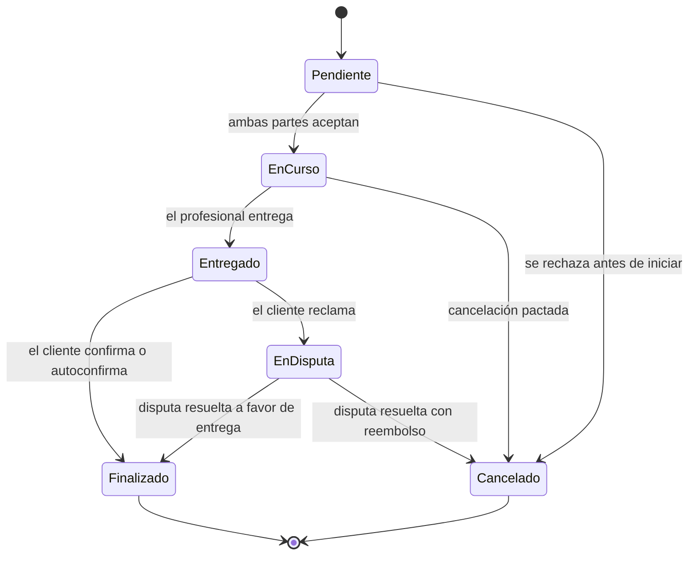
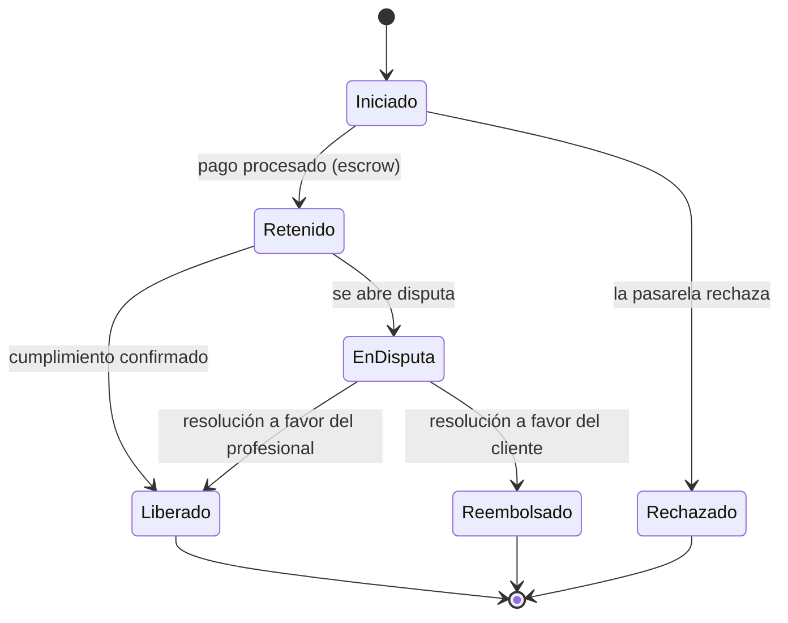
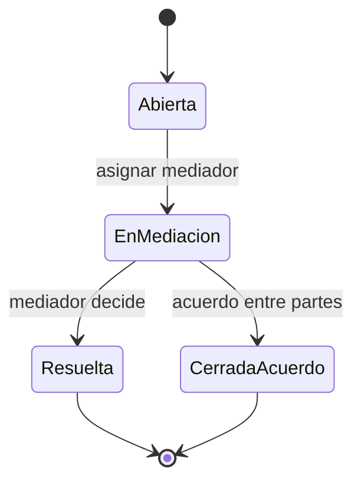

# Especificación de Requisitos de Software (ERS)

## Plataforma de gestión y creación de contratos «NAP»

> Elaborado conforme al estándar IEEE 830-1998

| Campo | Detalle |
| --- | --- |
| **Documento** | Especificación de Requisitos de Software |
| **Versión** | 1.1 |
| **Fecha** | 18 de junio de 2026 |
| **Empresa** | Nothing Sense (En formación) |
| **Autor** | Steven Ricardo Quiñones (CTO) |
| **Revisor** | Fredinson Solano (CEO) |
| **Ciudad** | Montería, Córdoba, Colombia |
| **Carácter** | Uso interno |

---

## Historial de revisiones

| Versión | Fecha | Descripción | Autor |
| --- | --- | --- | --- |
| 0.9 | 17/06/2026 | Borrador con introducción, descripción general y requisitos funcionales/no funcionales. | Steven R. Quiñones |
| 1.0 | 17/06/2026 | Primera versión completa: se incorporan reglas de negocio, criterios de aceptación, casos de uso detallados, modelo conceptual de datos, diagramas de estado, matrices de trazabilidad y aprobación del documento. | Steven R. Quiñones |
| 1.1 | 18/06/2026 | Actualización gerencial: Modelo operativo financiero, firmas, escrow, comisiones dinámicas, multas por disputas y exclusión de responsabilidad. | Fredinson Solano |

---

## Tabla de contenido

- [1. Introducción](#1-introducción)
  - [1.1 Propósito](#11-propósito)
  - [1.2 Alcance del producto](#12-alcance-del-producto)
  - [1.3 Definiciones, acrónimos y abreviaturas](#13-definiciones-acrónimos-y-abreviaturas)
  - [1.4 Referencias](#14-referencias)
  - [1.5 Visión general del documento](#15-visión-general-del-documento)
- [2. Descripción general](#2-descripción-general)
  - [2.1 Perspectiva del producto](#21-perspectiva-del-producto)
  - [2.2 Funciones del producto](#22-funciones-del-producto)
  - [2.3 Características de los usuarios](#23-características-de-los-usuarios)
  - [2.4 Restricciones](#24-restricciones)
  - [2.5 Suposiciones y dependencias](#25-suposiciones-y-dependencias)
  - [2.6 Evolución previsible del sistema](#26-evolución-previsible-del-sistema)
  - [2.7 Estrategia de Lanzamiento (Go-To-Market)](#27-estrategia-de-lanzamiento-go-to-market)
  - [2.8 Modelo de Operación Financiera](#28-modelo-de-operación-financiera)
- [3. Requisitos específicos](#3-requisitos-específicos)
  - [3.1 Requisitos de interfaces externas](#31-requisitos-de-interfaces-externas)
  - [3.2 Requisitos funcionales](#32-requisitos-funcionales)
  - [3.3 Requisitos de rendimiento](#33-requisitos-de-rendimiento)
  - [3.4 Restricciones de diseño](#34-restricciones-de-diseño)
  - [3.5 Atributos del sistema de software](#35-atributos-del-sistema-de-software)
  - [3.6 Otros requisitos](#36-otros-requisitos)
  - [3.7 Reglas de negocio](#37-reglas-de-negocio)
  - [3.8 Criterios de aceptación](#38-criterios-de-aceptación)
- [4. Modelos de análisis](#4-modelos-de-análisis)
  - [4.1 Diagrama de casos de uso](#41-diagrama-de-casos-de-uso)
  - [4.2 Casos de uso detallados](#42-casos-de-uso-detallados)
  - [4.3 Modelo conceptual de datos](#43-modelo-conceptual-de-datos)
  - [4.4 Diagramas de estados](#44-diagramas-de-estados)
- [5. Matrices de trazabilidad](#5-matrices-de-trazabilidad)
  - [5.1 Trazabilidad casos de uso ↔ requisitos funcionales](#51-trazabilidad-casos-de-uso--requisitos-funcionales)
  - [5.2 Trazabilidad requisitos funcionales ↔ no funcionales](#52-trazabilidad-requisitos-funcionales--no-funcionales)
  - [5.3 Trazabilidad requisitos funcionales ↔ reglas de negocio](#53-trazabilidad-requisitos-funcionales--reglas-de-negocio)
  - [5.4 Trazabilidad objetivos ↔ requisitos](#54-trazabilidad-objetivos--requisitos)
- [6. Apéndices](#6-apéndices)
  - [6.1 Apéndice A. Actores del sistema](#61-apéndice-a-actores-del-sistema)
  - [6.2 Apéndice B. Glosario extendido y notas finales](#62-apéndice-b-glosario-extendido-y-notas-finales)
  - [6.3 Apéndice C. Aprobación del documento](#63-apéndice-c-aprobación-del-documento)

---

## 1. Introducción

### 1.1 Propósito

El presente documento tiene como propósito definir, de manera detallada y estructurada, los requisitos funcionales y no funcionales de la plataforma de gestión y creación de contratos «NAP». Sirve como referencia común entre los interesados —usuarios, equipo de desarrollo, equipo de pruebas y partes académicas— para comprender el alcance del sistema, sus funciones y sus restricciones.

Asimismo, constituye la base para las fases de diseño, implementación, verificación y validación del software. El documento se ha elaborado siguiendo las recomendaciones del estándar IEEE 830-1998 para la especificación de requisitos de software.

### 1.2 Alcance del producto

El producto de software se denomina «NAP». Es una plataforma web que integra, en un único entorno, la conexión ágil entre personas con necesidades puntuales y profesionales capaces de resolverlas, así como la administración estructurada de contratos formales y corporativos de mayor duración, ofreciendo a las empresas un modelo B2B (suscripción) para gestionar su portafolio de contratistas.

El sistema permitirá registrar usuarios individuales y corporativos; publicar necesidades y servicios; emparejar oferta y demanda; generar contratos a partir de plantillas, tanto informales y simplificadas como formales y corporativas; negociar y firmar electrónicamente dichos contratos; gestionar pagos con custodia de fondos; hacer seguimiento del ciclo de vida contractual; y administrar las valoraciones, notificaciones y disputas asociadas.

Es vital aclarar que en el modelo formal, **NAP actúa exclusivamente como mediador y facilitador tecnológico** para el encuentro y la gestión de contratos. Los contratos formales se suscriben directa y exclusivamente entre la empresa contratante y el profesional. NAP queda totalmente excluida como parte contractual de dichas relaciones.

El sistema no pretende sustituir la asesoría jurídica profesional ni constituir, por sí mismo, una autoridad de certificación digital; cuando la firma electrónica requiera mecanismos certificados, la plataforma se integrará con proveedores externos especializados. Tampoco contempla, en esta versión, la gestión contable integral de las organizaciones, pero sí su integración con facturación electrónica DIAN para el cobro de sus propias comisiones.

Entre los objetivos del producto se encuentran: reducir el tiempo y la fricción para formalizar acuerdos, ofrecer trazabilidad y seguridad jurídica a las relaciones contractuales, y centralizar en una sola herramienta distintos niveles de formalidad contractual.

### 1.3 Definiciones, acrónimos y abreviaturas

La siguiente tabla recoge los términos y acrónimos empleados a lo largo del documento.

| Término / Acrónimo | Definición |
| --- | --- |
| **ERS** | Especificación de Requisitos de Software. |
| **IEEE** | Institute of Electrical and Electronics Engineers, entidad que publica el estándar 830. |
| **RF** | Requisito funcional: una función o comportamiento que el sistema debe ofrecer. |
| **RNF** | Requisito no funcional: una cualidad o restricción del sistema (rendimiento, seguridad, etc.). |
| **RN** | Regla de negocio: política, restricción o cálculo del dominio que el sistema debe respetar. |
| **CU** | Caso de uso: descripción de una interacción entre un actor y el sistema para lograr un objetivo. |
| **Contrato informal** | Acuerdo breve y de baja formalidad orientado a resolver una necesidad puntual o a prestar un servicio. |
| **Contrato formal** | Acuerdo estructurado, fijo o corporativo, para relaciones laborales o de servicio de mayor duración. |
| **Emparejamiento (matching)** | Proceso de conectar una necesidad con el profesional o la empresa que puede satisfacerla. |
| **Firma electrónica** | Mecanismo que permite expresar el consentimiento sobre un documento por medios electrónicos. |
| **Custodia de fondos (escrow)** | Retención de un pago por un tercero hasta que se cumplan las condiciones acordadas. |
| **CLM** | Contract Lifecycle Management: gestión del ciclo de vida del contrato. |
| **KYC** | Know Your Customer: verificación de la identidad del usuario. |
| **RBAC** | Role-Based Access Control: control de acceso basado en roles. |
| **MFA** | Multi-Factor Authentication: autenticación de múltiples factores. |
| **SLA** | Service Level Agreement: acuerdo de nivel de servicio. |
| **Hito (milestone)** | Punto de avance verificable de un contrato al que puede asociarse la liberación de un pago. |
| **Hash** | Resumen criptográfico que permite verificar la integridad de un documento. |

### 1.4 Referencias

- IEEE Std 830-1998, IEEE Recommended Practice for Software Requirements Specifications.
- Congreso de la República de Colombia, Ley 527 de 1999, por la cual se define y reglamenta el acceso y uso de los mensajes de datos, del comercio electrónico y de las firmas digitales.
- Congreso de la República de Colombia, Ley 1581 de 2012, por la cual se dictan disposiciones generales para la protección de datos personales.
- ISO/IEC 25010, Modelo de calidad del producto de software.
- OWASP Foundation, OWASP Top 10.
- OMG, Unified Modeling Language (UML) Specification, versión 2.5.1.

### 1.5 Visión general del documento

El documento se organiza en seis secciones principales. La sección 1 (Introducción) presenta el propósito, el alcance, las definiciones y las referencias. La sección 2 (Descripción general) describe la perspectiva del producto, sus funciones, los tipos de usuario, las restricciones y las suposiciones. La sección 3 (Requisitos específicos) detalla las interfaces externas, los requisitos funcionales, los requisitos no funcionales, las reglas de negocio y los criterios de aceptación. La sección 4 (Modelos de análisis) incorpora el diagrama y las descripciones de los casos de uso, el modelo conceptual de datos y los diagramas de estados. La sección 5 (Matrices de trazabilidad) relaciona casos de uso, requisitos, reglas de negocio y objetivos. Finalmente, la sección 6 (Apéndices) incluye los actores, un glosario extendido y la aprobación del documento.

---

## 2. Descripción general

### 2.1 Perspectiva del producto

«NAP» es un producto nuevo e independiente, no derivado de un sistema preexistente, aunque se apoya en servicios externos. Desde el punto de vista funcional combina dos paradigmas: un mercado de servicios (marketplace) que conecta oferta y demanda de manera ágil, y un sistema de gestión del ciclo de vida de contratos (CLM) orientado a relaciones formales y corporativas.

Los usuarios interactúan con el sistema a través de un navegador web. La plataforma se integra con servicios externos para el procesamiento de pagos (pasarela de pago), la firma electrónica certificada (proveedor especializado), el envío de correos electrónicos y el almacenamiento de documentos. Internamente, el sistema se estructura en módulos cooperantes: identidad y acceso, perfiles, emparejamiento, contratos, firma electrónica, pagos, reputación, notificaciones, disputas, reportes y administración.

El siguiente diagrama de contexto distingue tres elementos: el **sistema en estudio** («NAP»), los **actores** (personas o roles que usan la plataforma) y los **sistemas externos** con los que se integra. Cada flecha representa el intercambio bidireccional de datos, etiquetado con la naturaleza de la interacción.

*Figura 1. Diagrama de contexto de la plataforma «NAP» y sus integraciones externas.*

### 2.2 Funciones del producto

De forma resumida, el sistema ofrecerá las siguientes funciones principales:

- Registro, autenticación y gestión de usuarios individuales y corporativos con roles diferenciados.
- Creación y administración de perfiles profesionales y de empresa.
- Publicación de necesidades y de servicios, búsqueda con filtros y emparejamiento automático.
- Generación y gestión de contratos informales (rápidos) a partir de plantillas simplificadas.
- Generación y gestión de contratos formales y corporativos con ciclo de vida estructurado.
- Firma electrónica de contratos con validación de integridad y auditoría.
- Gestión de pagos con custodia de fondos y liberación por hitos o cumplimiento.
- Calificaciones, reseñas y cálculo de reputación.
- Notificaciones, gestión de disputas, reportes y administración de la plataforma.

### 2.3 Características de los usuarios

La plataforma está dirigida a distintos perfiles de usuario, con diferentes niveles de formalidad contractual y de experiencia técnica.

| Tipo de usuario | Descripción | Nivel técnico |
| --- | --- | --- |
| **Cliente individual** | Persona que publica una necesidad o problema y busca a alguien que lo resuelva. | Básico |
| **Profesional / Prestador** | Persona que ofrece sus conocimientos o habilidades y se postula a necesidades o publica servicios. | Básico–Medio |
| **Usuario corporativo (empresa)** | Organización que gestiona contratos formales y corporativos con profesionales o proveedores. | Medio |
| **Administrador** | Personal de la plataforma encargado de operarla, configurarla y supervisarla. | Avanzado |
| **Mediador** | Rol responsable de gestionar y mediar las disputas entre las partes. | Medio |

### 2.4 Restricciones

- El sistema debe cumplir la legislación colombiana sobre comercio electrónico, firma y protección de datos personales.
- **Riesgo Financiero y Custodia:** Para evitar la "captación masiva y habitual de dinero" (delito en Colombia), la plataforma no recibirá fondos en sus cuentas propias para el escrow. Se utilizará obligatoriamente un modelo de *Split de Pagos* o *Fiducia* mediante pasarelas de pago autorizadas por la Superintendencia Financiera (ej. ePayco, MercadoPago, etc.).
- **Facturación DIAN:** El sistema debe prever la facturación electrónica DIAN obligatoria por las comisiones que cobra la plataforma a los usuarios.
- La solución debe ser una aplicación web responsiva, sin requerir la instalación de software adicional por parte del usuario.
- El sistema depende de servicios externos para el pago y para la firma electrónica. Se debe distinguir entre "Firma Electrónica Simple" (OTP, clickwrap, logs) para contratos rápidos y "Firma Digital Certificada" para los formales que lo exijan.
- La interfaz debe ofrecerse, como mínimo, en idioma español.
- Los datos sensibles y los documentos contractuales deben protegerse mediante cifrado y control de acceso.

### 2.5 Suposiciones y dependencias

- Se asume que los usuarios disponen de un dispositivo con navegador y conexión a internet.
- Se asume la disponibilidad de una pasarela de pago y de un proveedor de firma electrónica con sus respectivas interfaces.
- Se asume que los usuarios proporcionan información veraz durante el registro y la verificación de identidad.
- El correcto funcionamiento de las notificaciones por correo depende del servicio de mensajería contratado.

### 2.6 Evolución previsible del sistema

Se prevén las siguientes líneas de evolución posteriores a esta versión:

- **Validación de Seguridad Social (PILA):** Integración (vía OCR o API) para exigir que, antes de liberar un pago final en contratos formales, el contratista demuestre el pago de su seguridad social, mitigando el riesgo de responsabilidad solidaria para la empresa contratante.
- Aplicación móvil nativa para Android e iOS.
- Asistencia basada en inteligencia artificial para recomendar coincidencias y apoyar la redacción de cláusulas.
- Soporte multi-idioma y multi-moneda para operar en otros mercados.
- Integraciones con sistemas contables y de facturación electrónica.

### 2.7 Estrategia de Lanzamiento (Go-To-Market)

Para solventar el problema de adquirir oferta y demanda simultáneamente en el ecosistema, se plantea una metodología de despliegue gradual en fase beta:

1. **Gancho Corporativo B2B (La Base):** Contactar proactivamente a un grupo selecto de empresas ofreciendo una suscripción a la plataforma para gestionar sus contratos. El objetivo es que ellas inviten a sus propios contratistas y freelancers actuales a usar la plataforma para organizarse.
2. **Siembra de la Oferta (Profesionales):** Una vez los profesionales ingresan al sistema (invitados por empresas), se les incentiva a crear su perfil público y publicar servicios. Esto genera un catálogo base de oferta en el sistema.
3. **Campaña C2C / Trabajos Informales:** Con una base de profesionales ya registrados en la plataforma, se realiza una campaña focalizada para la función inicial de "trabajos informales" y resolución de necesidades puntuales, permitiendo a los clientes individuales encontrar proveedores rápidamente y generar las primeras transacciones (entrada suave).

### 2.8 Modelo de Operación Financiera

La plataforma manejará los fondos y las obligaciones fiscales mediante el siguiente modelo para el mercado colombiano:

- **Custodia mediante Split de Pagos:** Se empleará una pasarela de pago (Opción principal: ePayco o similar) que soporte el modelo *Split de Pagos* (o *Marketplace*). El pago del cliente ingresará a la pasarela, la cual retendrá los fondos temporalmente. Al confirmarse el servicio, la pasarela dispersará el pago directamente al proveedor (con fuerte enfoque en permitir retiros y cobros hacia **Nequi**, dada su alta adopción) y la comisión respectiva hacia NAP, evitando que NAP actúe como captador de fondos del público.
- **Facturación Electrónica DIAN:** Toda comisión cobrada por NAP a los usuarios (tanto por transacción informal como por suscripción B2B) estará respaldada por una factura electrónica emitida automáticamente mediante la API de un Proveedor Tecnológico autorizado por la DIAN (ej. Alegra, Siigo, Facturadora.com), garantizando el cumplimiento tributario desde el inicio.

---

## 3. Requisitos específicos

### 3.1 Requisitos de interfaces externas

#### 3.1.1 Interfaces de usuario

El sistema proporcionará una interfaz web responsiva, en español, accesible desde navegadores de escritorio y móviles. La interfaz debe ser intuitiva, coherente y orientada a tareas, facilitando los flujos de publicación, emparejamiento, contratación, firma y pago.

A continuación se relaciona el inventario de pantallas principales previsto para la primera versión. Sirve de guía para el diseño de interfaz y para la planificación de pruebas de usabilidad.

| Código | Pantalla | Descripción | Actores |
| --- | --- | --- | --- |
| **IU-01** | Registro / Inicio de sesión | Alta de cuenta individual o corporativa, autenticación y recuperación de contraseña. | Todos |
| **IU-02** | Verificación de identidad (KYC) | Carga y validación de datos e documentos de identidad. | Cliente, Profesional, Empresa |
| **IU-03** | Panel de control (dashboard) | Resumen de contratos, acuerdos, pagos y notificaciones. | Cliente, Profesional, Empresa |
| **IU-04** | Perfil | Edición de perfil profesional o de empresa, habilidades y portafolio. | Profesional, Empresa |
| **IU-05** | Publicar necesidad | Formulario para describir alcance, categoría, presupuesto y plazo. | Cliente |
| **IU-06** | Explorar / Buscar | Listado con filtros de necesidades, servicios y profesionales. | Cliente, Profesional |
| **IU-07** | Detalle de necesidad y propuestas | Vista de una necesidad con las propuestas recibidas. | Cliente, Profesional |
| **IU-08** | Mensajería interna | Canal de conversación entre las partes. | Cliente, Profesional, Empresa |
| **IU-09** | Editor de contrato | Edición de plantillas, cláusulas y control de versiones. | Cliente, Profesional, Empresa |
| **IU-10** | Firma electrónica | Flujo de revisión y firma del contrato. | Cliente, Profesional, Empresa |
| **IU-11** | Pagos y custodia | Registro de métodos de pago, custodia y liberación de fondos. | Cliente, Profesional, Empresa |
| **IU-12** | Disputas | Apertura, seguimiento y mediación de disputas con evidencias. | Cliente, Profesional, Empresa, Mediador |
| **IU-13** | Reportes | Generación y exportación de reportes e indicadores. | Empresa, Administrador |
| **IU-14** | Panel de administración | Gestión de usuarios, plantillas, categorías, moderación y auditoría. | Administrador |

#### 3.1.2 Interfaces de hardware

El sistema no requiere hardware especializado por parte del usuario. Del lado del cliente basta con un dispositivo con navegador y conexión a internet. Del lado del servidor, la plataforma se desplegará sobre infraestructura de servidores o de nube con capacidad acorde a la carga prevista.

#### 3.1.3 Interfaces de software

El sistema se integrará con: una pasarela de pago para el procesamiento de transacciones; un proveedor de firma electrónica para la formalización de contratos; un servicio de correo electrónico para las notificaciones; y un servicio de almacenamiento para los documentos. Estas integraciones se realizarán a través de las interfaces de programación (API) que expongan dichos servicios.

#### 3.1.4 Interfaces de comunicación

La comunicación entre el cliente y el servidor se realizará sobre el protocolo HTTPS (HTTP sobre TLS). Las integraciones con servicios externos emplearán protocolos seguros y mecanismos de autenticación adecuados.

### 3.2 Requisitos funcionales

Los requisitos funcionales se organizan por módulos funcionales, dado que la plataforma NAP presenta agrupaciones naturales de funcionalidad (gestión de usuarios, perfiles, contratos informales, contratos formales, firma electrónica, pagos, reputación, notificaciones, disputas, reportes y administración) con límites bien definidos entre sí. Este enfoque facilita la asignación de responsabilidades al equipo de desarrollo, la trazabilidad con los componentes de diseño y la planificación incremental de las pruebas. Se eligió frente a las alternativas del estándar (por tipos de usuario, por objetos, por objetivos, por estímulos o por jerarquía funcional) porque los módulos reflejan con mayor claridad la arquitectura lógica del sistema. Cada requisito se identifica con un código único (RF-XXX), un nombre, una descripción y una prioridad relativa (Alta, Media o Baja).

#### 3.2.1 Gestión de usuarios, registro y autenticación

Agrupa las funcionalidades que permiten a las personas y a las empresas acceder a la plataforma de forma segura y con roles diferenciados.

| ID | Requisito | Prioridad |
| --- | --- | --- |
| **RF-001** | **Registro de usuario individual.** El sistema debe permitir que una persona natural se registre proporcionando datos básicos (nombre, correo electrónico y contraseña) y aceptando los términos de uso y la política de tratamiento de datos. | Alta |
| **RF-002** | **Registro de usuario corporativo.** El sistema debe permitir el registro de empresas mediante datos corporativos (razón social, NIT, representante legal y datos de contacto) para habilitar la gestión de contratos formales. | Alta |
| **RF-003** | **Verificación de identidad (KYC).** El sistema debe ofrecer un mecanismo de verificación de identidad del usuario o de la empresa antes de habilitar la firma de contratos. | Alta |
| **RF-004** | **Inicio de sesión.** El sistema debe permitir a los usuarios autenticarse mediante correo electrónico y contraseña y, opcionalmente, mediante proveedores de identidad externos. | Alta |
| **RF-005** | **Recuperación de contraseña.** El sistema debe permitir restablecer la contraseña a través de un enlace seguro enviado al correo registrado. | Media |
| **RF-006** | **Autenticación multifactor (MFA).** El sistema debe ofrecer un segundo factor de autenticación para las operaciones sensibles, como la firma de contratos o la gestión de pagos. | Media |
| **RF-007** | **Gestión de roles y permisos.** El sistema debe administrar distintos roles (cliente, profesional, empresa y administrador) con permisos diferenciados sobre las funcionalidades. | Alta |
| **RF-008** | **Cierre y suspensión de cuenta.** El sistema debe permitir al usuario desactivar su cuenta y al administrador suspenderla en caso de incumplimiento de las políticas. | Media |

#### 3.2.2 Gestión de perfiles

Permite a los usuarios construir su identidad dentro de la plataforma y dar a conocer sus capacidades.

| ID | Requisito | Prioridad |
| --- | --- | --- |
| **RF-009** | **Perfil profesional.** El sistema debe permitir a los profesionales crear y editar un perfil con sus habilidades, experiencia, certificaciones y portafolio de trabajos. | Alta |
| **RF-010** | **Perfil de empresa.** El sistema debe permitir a las empresas mantener un perfil con su información corporativa, áreas de servicio y representantes autorizados. | Alta |
| **RF-011** | **Catálogo de servicios y habilidades.** El sistema debe permitir registrar los servicios o habilidades ofrecidos, clasificados por categorías. | Media |
| **RF-012** | **Visualización pública de perfiles.** El sistema debe mostrar perfiles públicos con la información que el usuario decida hacer visible, incluyendo su reputación. | Media |
| **RF-013** | **Gestión de disponibilidad.** El sistema debe permitir a los profesionales indicar su disponibilidad para asumir nuevos trabajos o contratos. | Baja |

#### 3.2.3 Publicación, búsqueda y emparejamiento

Constituye el núcleo de conexión ágil entre quienes tienen una necesidad y quienes pueden resolverla.

| ID | Requisito | Prioridad |
| --- | --- | --- |
| **RF-014** | **Publicación de necesidad.** El sistema debe permitir a un cliente publicar una necesidad o problema, describiendo el alcance, la categoría, el presupuesto estimado y el plazo deseado. | Alta |
| **RF-015** | **Publicación de oferta de servicio.** El sistema debe permitir a un profesional publicar ofertas de servicio visibles para potenciales clientes. | Media |
| **RF-016** | **Búsqueda con filtros.** El sistema debe permitir buscar necesidades, servicios o profesionales aplicando filtros por categoría, ubicación, presupuesto, valoración y disponibilidad. | Alta |
| **RF-017** | **Emparejamiento y recomendaciones.** El sistema debe sugerir automáticamente coincidencias entre necesidades y profesionales con base en la categoría, las habilidades y la reputación. | Media |
| **RF-018** | **Postulaciones y propuestas.** El sistema debe permitir a los profesionales postularse a una necesidad enviando una propuesta con alcance, precio y tiempo de entrega. | Alta |
| **RF-019** | **Mensajería interna.** El sistema debe proporcionar un canal de mensajería interna entre las partes para acordar los detalles previos al contrato. | Media |

#### 3.2.4 Gestión de contratos informales (rápidos)

Soporta los acuerdos breves orientados a la resolución puntual de problemas o a la prestación de servicios, con baja formalidad y alta agilidad.

| ID | Requisito | Prioridad |
| --- | --- | --- |
| **RF-020** | **Generación desde plantilla simplificada.** El sistema debe generar automáticamente un acuerdo a partir de una plantilla simplificada cuando ambas partes aceptan una propuesta. | Alta |
| **RF-021** | **Definición de alcance, precio y plazo.** El sistema debe permitir definir y registrar el alcance del trabajo, el precio acordado y el plazo de entrega del acuerdo informal. | Alta |
| **RF-022** | **Aceptación rápida del acuerdo.** El sistema debe permitir que ambas partes acepten el acuerdo de forma ágil, dejando constancia de la conformidad. | Alta |
| **RF-023** | **Seguimiento del estado.** El sistema debe registrar y mostrar el estado del acuerdo (pendiente, en curso, entregado, finalizado o cancelado). | Media |
| **RF-024** | **Confirmación de cumplimiento.** El sistema debe permitir al cliente confirmar la entrega o el cumplimiento del trabajo para dar por finalizado el acuerdo. | Alta |

#### 3.2.5 Gestión de contratos formales y corporativos

Soporta las relaciones laborales o de servicio de mayor estabilidad y duración entre empresas y profesionales, con un ciclo de vida estructurado.

| ID | Requisito | Prioridad |
| --- | --- | --- |
| **RF-025** | **Biblioteca de plantillas formales.** El sistema debe ofrecer una biblioteca de plantillas de contratos formales clasificadas por tipo (laboral, prestación de servicios, confidencialidad, entre otros). | Alta |
| **RF-026** | **Editor de cláusulas y términos.** El sistema debe permitir editar, añadir o eliminar cláusulas y términos contractuales sobre una plantilla base. | Alta |
| **RF-027** | **Negociación y control de versiones.** El sistema debe permitir a las partes proponer cambios sobre el contrato y mantener un historial de versiones de la negociación. | Alta |
| **RF-028** | **Flujo de aprobación multinivel.** El sistema debe soportar flujos de aprobación con uno o varios niveles antes de habilitar la firma de un contrato corporativo. | Media |
| **RF-029** | **Ciclo de vida del contrato.** El sistema debe gestionar el ciclo de vida completo del contrato: borrador, revisión, aprobación, firma, vigencia, renovación y terminación. | Alta |
| **RF-030** | **Alertas de vencimiento y renovación.** El sistema debe notificar, con una antelación configurable, los vencimientos y las fechas de renovación de los contratos. | Media |
| **RF-031** | **Gestión de hitos y obligaciones.** El sistema debe permitir registrar hitos, entregables y obligaciones asociados a un contrato y hacer seguimiento de su cumplimiento. | Media |
| **RF-032** | **Repositorio documental con versionado.** El sistema debe almacenar los contratos y documentos anexos con control de versiones y trazabilidad de los cambios. | Alta |

#### 3.2.6 Firma electrónica

Garantiza la formalización de los acuerdos y contratos con validez e integridad.

| ID | Requisito | Prioridad |
| --- | --- | --- |
| **RF-033** | **Firma electrónica de contratos.** El sistema debe permitir firmar los acuerdos, diferenciando entre firma electrónica simple (OTP/Clickwrap) para informales y firma digital certificada para formales. Para contratos formales, se priorizará un proveedor local certificado (ej. Autentic, Certicámara) con DocuSign como alternativa de respaldo. | Alta |
| **RF-034** | **Validación e integridad.** El sistema debe garantizar la integridad del documento firmado mediante sello de tiempo y resumen criptográfico (hash). | Alta |
| **RF-035** | **Registro de auditoría de la firma.** El sistema debe conservar un registro de auditoría robusto del proceso de firma (identidad, fecha, hora, dirección IP y validación MFA del firmante). | Alta |
| **RF-036** | **Múltiples firmantes.** El sistema debe soportar la firma secuencial o paralela de varios firmantes sobre un mismo contrato. | Media |

#### 3.2.7 Gestión de pagos

Administra las transacciones económicas derivadas de los acuerdos y contratos, con mecanismos de confianza para ambas partes.

| ID | Requisito | Prioridad |
| --- | --- | --- |
| **RF-037** | **Registro de métodos de pago.** El sistema debe permitir registrar y administrar métodos de pago de los usuarios a través de una pasarela de pago. | Alta |
| **RF-038** | **Procesamiento de pagos.** El sistema debe procesar de forma segura los pagos asociados a acuerdos y contratos. | Alta |
| **RF-039** | **Custodia de fondos (escrow).** El sistema debe ofrecer la retención de fondos en custodia hasta la confirmación del cumplimiento del acuerdo. | Media |
| **RF-040** | **Liberación por hitos o cumplimiento.** El sistema debe liberar los pagos al confirmarse el cumplimiento total o de los hitos definidos. | Media |
| **RF-041** | **Facturación y comprobantes.** El sistema debe generar comprobantes y facturas de las transacciones realizadas. | Media |
| **RF-042** | **Historial de transacciones.** El sistema debe mantener un historial consultable de todas las transacciones del usuario. | Media |

#### 3.2.8 Calificaciones y reputación

Aporta confianza al ecosistema mediante la valoración mutua de las partes.

| ID | Requisito | Prioridad |
| --- | --- | --- |
| **RF-043** | **Calificación mutua.** El sistema debe permitir que el cliente y el profesional se califiquen mutuamente al finalizar un contrato o acuerdo. | Media |
| **RF-044** | **Reseñas y comentarios.** El sistema debe permitir dejar reseñas y comentarios sobre la experiencia de colaboración. | Baja |
| **RF-045** | **Cálculo de reputación.** El sistema debe calcular y mostrar una valoración promedio que refleje la reputación del usuario. | Media |

#### 3.2.9 Notificaciones

Mantiene informados a los usuarios sobre los eventos relevantes del ciclo contractual.

| ID | Requisito | Prioridad |
| --- | --- | --- |
| **RF-046** | **Notificaciones en la aplicación.** El sistema debe mostrar notificaciones dentro de la aplicación sobre eventos relevantes (propuestas, firmas, pagos y vencimientos). | Media |
| **RF-047** | **Notificaciones por correo electrónico.** El sistema debe enviar notificaciones por correo electrónico de los eventos críticos del ciclo contractual. | Media |
| **RF-048** | **Preferencias de notificación.** El sistema debe permitir al usuario configurar qué notificaciones desea recibir y por qué canal. | Baja |

#### 3.2.10 Resolución de disputas

Ofrece un mecanismo de gestión de conflictos asociado a los acuerdos y contratos, estructurado legalmente como amigable composición.

| ID | Requisito | Prioridad |
| --- | --- | --- |
| **RF-049** | **Apertura de disputa.** El sistema debe permitir a cualquiera de las partes abrir una disputa o reclamo asociado a un contrato o acuerdo. | Media |
| **RF-050** | **Gestión y amigable composición.** El sistema debe ofrecer un flujo de gestión de disputas. Las partes aceptan previamente que la decisión del mediador de NAP es vinculante (amigable composición) para la liberación de los fondos. | Media |
| **RF-051** | **Registro de evidencias.** El sistema debe permitir adjuntar evidencias (archivos y mensajes) al expediente de la disputa. | Baja |

#### 3.2.11 Reportes y paneles de control

Proporciona visibilidad sobre la actividad contractual a usuarios individuales y corporativos.

| ID | Requisito | Prioridad |
| --- | --- | --- |
| **RF-052** | **Panel de control del usuario.** El sistema debe ofrecer a cada usuario un panel con el resumen de sus contratos, acuerdos, pagos y notificaciones. | Media |
| **RF-053** | **Reportes de contratos.** El sistema debe generar reportes sobre el estado, los vencimientos y el valor de los contratos. | Media |
| **RF-054** | **Indicadores corporativos.** El sistema debe ofrecer a los usuarios corporativos indicadores agregados sobre su cartera de contratos y proveedores. | Baja |
| **RF-055** | **Exportación de reportes.** El sistema debe permitir exportar los reportes en formatos PDF y de hoja de cálculo. | Baja |

#### 3.2.12 Administración de la plataforma

Permite al equipo administrador operar, configurar y supervisar el sistema.

| ID | Requisito | Prioridad |
| --- | --- | --- |
| **RF-056** | **Gestión de usuarios.** El sistema debe permitir al administrador consultar, habilitar, suspender o eliminar cuentas de usuario. | Alta |
| **RF-057** | **Gestión de plantillas y categorías.** El sistema debe permitir al administrador crear y mantener las plantillas de contrato y las categorías de servicios. | Media |
| **RF-058** | **Moderación de contenido.** El sistema debe permitir moderar perfiles, publicaciones y reseñas que incumplan las políticas de la plataforma. | Media |
| **RF-059** | **Monitoreo y auditoría.** El sistema debe registrar y permitir auditar las acciones relevantes realizadas en la plataforma. | Alta |
| **RF-060** | **Configuración de parámetros.** El sistema debe permitir configurar parámetros generales (comisiones, plazos por defecto y notificaciones). | Media |

### 3.3 Requisitos de rendimiento

Definen el comportamiento esperado del sistema en términos de tiempos de respuesta, concurrencia y capacidad.

| ID | Requisito | Prioridad |
| --- | --- | --- |
| **RNF-001** | **Tiempo de respuesta.** El 95 % de las operaciones de consulta deben responder en menos de 3 segundos bajo condiciones normales de operación. | Alta |
| **RNF-002** | **Usuarios concurrentes.** El sistema debe soportar al menos 5.000 usuarios concurrentes sin degradación significativa del rendimiento. | Alta |
| **RNF-003** | **Capacidad transaccional.** El sistema debe procesar de forma confiable las operaciones de firma y de pago, garantizando su consistencia. | Alta |
| **RNF-004** | **Tiempo de carga.** Las páginas principales deben cargar su contenido inicial en menos de 2 segundos sobre una conexión de banda ancha estándar. | Media |
| **RNF-024** | **Capacidad y crecimiento de almacenamiento.** El sistema debe dimensionar su almacenamiento para soportar el crecimiento previsto de contratos, documentos y registros, permitiendo su ampliación sin interrupción del servicio. | Media |

### 3.4 Restricciones de diseño

Recogen las limitaciones de carácter tecnológico, normativo y de proceso que condicionan la solución.

| ID | Requisito | Prioridad |
| --- | --- | --- |
| **RNF-005** | **Aplicación web responsiva.** El sistema debe ser una aplicación web responsiva, accesible desde navegadores de escritorio y dispositivos móviles. | Alta |
| **RNF-006** | **Cumplimiento normativo.** El sistema debe cumplir la normativa colombiana aplicable, en particular la Ley 527 de 1999 (comercio electrónico y firma) y la Ley 1581 de 2012 (protección de datos personales). | Alta |
| **RNF-007** | **Estándares de desarrollo.** El desarrollo debe seguir estándares de codificación, control de versiones y buenas prácticas de ingeniería de software. | Media |
| **RNF-008** | **Navegadores soportados.** El sistema debe funcionar correctamente en las versiones recientes de Chrome, Firefox, Edge y Safari. | Media |
| **RNF-028** | **Límite de archivos adjuntos.** El sistema debe restringir el tamaño y el formato de los archivos adjuntos (anexos, evidencias y documentos), validándolos antes de su almacenamiento. | Media |

### 3.5 Atributos del sistema de software

#### 3.5.1 Fiabilidad

| ID | Requisito | Prioridad |
| --- | --- | --- |
| **RNF-009** | **Fiabilidad.** El sistema debe garantizar la integridad y la consistencia de los datos contractuales y financieros ante fallos. | Alta |
| **RNF-025** | **Idempotencia de pagos.** Las operaciones de pago y de liberación de fondos deben ser idempotentes, de modo que un reintento o una duplicación de solicitud no genere cargos ni liberaciones repetidos. | Alta |

#### 3.5.2 Disponibilidad

| ID | Requisito | Prioridad |
| --- | --- | --- |
| **RNF-010** | **Disponibilidad.** El sistema debe presentar una disponibilidad mínima del 99,5 % mensual. | Alta |

#### 3.5.3 Seguridad

| ID | Requisito | Prioridad |
| --- | --- | --- |
| **RNF-011** | **Cifrado en tránsito.** Las comunicaciones entre el cliente y el servidor deben protegerse mediante cifrado TLS. | Alta |
| **RNF-012** | **Protección de datos sensibles.** Las contraseñas deben almacenarse con funciones de hash robustas y los datos sensibles deben cifrarse en reposo. | Alta |
| **RNF-013** | **Control de acceso.** El sistema debe aplicar control de acceso basado en roles (RBAC) y el principio de mínimo privilegio. | Alta |
| **RNF-014** | **Mitigación de vulnerabilidades.** El sistema debe mitigar las vulnerabilidades web más comunes, tomando como referencia el OWASP Top 10. | Alta |

#### 3.5.4 Mantenibilidad

| ID | Requisito | Prioridad |
| --- | --- | --- |
| **RNF-015** | **Mantenibilidad.** El sistema debe tener una arquitectura modular y documentada que facilite su mantenimiento y evolución. | Media |

#### 3.5.5 Portabilidad

| ID | Requisito | Prioridad |
| --- | --- | --- |
| **RNF-016** | **Portabilidad.** El sistema debe poder desplegarse en distintos entornos de nube o servidores compatibles, evitando dependencias propietarias críticas. | Media |

#### 3.5.6 Usabilidad

| ID | Requisito | Prioridad |
| --- | --- | --- |
| **RNF-017** | **Usabilidad e idioma.** La interfaz debe ser intuitiva, estar en idioma español y seguir convenciones de usabilidad coherentes. | Alta |
| **RNF-018** | **Accesibilidad.** El sistema debe procurar el cumplimiento de las pautas de accesibilidad WCAG 2.1 en nivel AA. | Media |

#### 3.5.7 Escalabilidad

| ID | Requisito | Prioridad |
| --- | --- | --- |
| **RNF-019** | **Escalabilidad.** La arquitectura debe permitir el escalamiento horizontal para atender el crecimiento de usuarios y de contratos. | Media |

#### 3.5.8 Observabilidad

| ID | Requisito | Prioridad |
| --- | --- | --- |
| **RNF-026** | **Observabilidad.** El sistema debe registrar trazas, métricas y registros (logs) técnicos que permitan diagnosticar incidentes y supervisar el estado de los servicios. | Media |
| **RNF-027** | **Retención de registros.** Los registros de auditoría y los logs técnicos deben conservarse durante un período configurable que respete los requisitos legales y de seguridad. | Media |

### 3.6 Otros requisitos

Agrupan requisitos de privacidad, continuidad y conservación legal de la información.

| ID | Requisito | Prioridad |
| --- | --- | --- |
| **RNF-020** | **Privacidad y tratamiento de datos.** El sistema debe gestionar el consentimiento y los derechos de los titulares de datos conforme a la política de tratamiento de datos personales. | Alta |
| **RNF-021** | **Respaldo y recuperación.** El sistema debe realizar copias de seguridad periódicas y contar con un plan de recuperación ante desastres. | Alta |
| **RNF-022** | **Retención y archivo legal.** Los contratos firmados deben conservarse de forma íntegra durante el período legal exigido, garantizando su disponibilidad y validez probatoria. | Alta |
| **RNF-023** | **Internacionalización.** El sistema debe estar preparado para incorporar, en el futuro, otros idiomas y monedas. | Baja |
| **RNF-029** | **Zona horaria y formato de fecha.** El sistema debe registrar las marcas de tiempo en una referencia única (UTC) y presentarlas al usuario en su zona horaria local, evitando ambigüedades en plazos y vencimientos. | Media |

### 3.7 Reglas de negocio

Las reglas de negocio expresan las políticas, restricciones y cálculos del dominio que el sistema debe respetar con independencia de su implementación. Cada regla se identifica con un código único (RN-XXX) y se relaciona con los requisitos funcionales que la materializan.

| ID | Regla de negocio | Requisitos relacionados |
| --- | --- | --- |
| **RN-001** | La verificación de identidad (KYC) debe estar aprobada antes de que un usuario pueda firmar cualquier contrato o acuerdo. | RF-003, RF-033 |
| **RN-002** | Todo usuario debe aceptar los términos de uso y la política de tratamiento de datos para completar su registro. | RF-001, RF-002, RNF-020 |
| **RN-003** | La plataforma aplica una comisión dinámica (base ~10%, ajustable por promociones y tamaño del contrato) sobre cada transacción liquidada. | RF-038, RF-060 |
| **RN-004** | Los fondos en custodia solo se liberan al confirmarse el cumplimiento total o de los hitos definidos, o al vencer el plazo de reclamo sin objeción. | RF-039, RF-040, RF-024 |
| **RN-005** | Si se abre una disputa sobre un acuerdo con fondos en custodia, la liberación queda congelada hasta que la disputa se resuelva. | RF-049, RF-050, RF-039 |
| **RN-006** | Un contrato formal solo pasa al estado «vigente» cuando todas las partes requeridas lo han firmado. | RF-029, RF-033, RF-036 |
| **RN-007** | Tras la entrega de un acuerdo informal, el cliente dispone de un plazo máximo de 3 días para confirmar o reclamar; vencido el plazo sin acción, el acuerdo se autoconfirma. La reincidencia en esta omisión generará penalizaciones. | RF-023, RF-024, RF-060 |
| **RN-008** | La reputación de un usuario se calcula como el promedio de sus calificaciones y solo se muestra públicamente a partir de un número mínimo configurable de valoraciones. | RF-043, RF-045 |
| **RN-009** | El contenido de un contrato o acuerdo solo es visible para sus partes y, cuando corresponda, para el mediador o el administrador. | RF-007, RNF-013 |
| **RN-010** | Las operaciones de firma y de pago requieren un segundo factor de autenticación (MFA). | RF-006, RF-033, RF-038 |
| **RN-011** | Un usuario suspendido no puede publicar necesidades u ofertas, postularse, firmar ni recibir pagos. | RF-008, RF-056 |
| **RN-012** | Cada cambio aceptado durante la negociación de un contrato genera una nueva versión; las versiones firmadas son inmutables. | RF-027, RF-032, RF-034 |
| **RN-013** | Un contrato firmado no puede eliminarse; debe conservarse durante el período legal exigido. | RF-032, RNF-022 |
| **RN-014** | En esta versión la moneda de operación es el peso colombiano (COP) y los importes deben ser valores no negativos. | RF-021, RF-038, RNF-023 |
| **RN-015** | Las condiciones de cancelación de un acuerdo dependen de su estado: antes de iniciarse no genera penalidad; una vez en curso se rige por lo pactado entre las partes. | RF-023, RF-029 |
| **RN-016** | Disputas injustificadas: Si un usuario pierde una disputa calificada de mala fe, se le retendrá un 5% extra como costo de mediación y se suspenderá temporalmente su cuenta. | RF-050 |
| **RN-017** | La protección del Escrow y la validación de reputación aplican exclusivamente si los pagos y acuerdos ocurren dentro de NAP, eximiendo a la plataforma de toda responsabilidad por transacciones externas. | RF-039, RF-043 |

### 3.8 Criterios de aceptación

Para los requisitos de prioridad **Alta** se definen criterios de aceptación verificables, redactados en el formato «Dado / Cuando / Entonces». Constituyen la base para el diseño de los casos de prueba de aceptación.

| RF | Criterio de aceptación (verificable) |
| --- | --- |
| **RF-001** | Dado un visitante con datos válidos y los términos aceptados, cuando completa el registro, entonces se crea su cuenta y recibe una confirmación; si el correo ya existe o no acepta los términos, el registro se rechaza con un mensaje claro. |
| **RF-002** | Dada una empresa con NIT y representante legal válidos, cuando se registra, entonces se crea la cuenta corporativa habilitada para gestionar contratos formales. |
| **RF-003** | Dado un usuario sin KYC aprobado, cuando intenta firmar un contrato, entonces el sistema lo impide e indica que debe completar la verificación de identidad. |
| **RF-004** | Dado un usuario registrado, cuando ingresa credenciales correctas, entonces obtiene acceso; tras varios intentos fallidos consecutivos el acceso se bloquea temporalmente. |
| **RF-007** | Dado un usuario con un rol asignado, cuando intenta una acción fuera de sus permisos, entonces el sistema la deniega y registra el intento. |
| **RF-009** | Dado un profesional autenticado, cuando edita su perfil (habilidades, experiencia, portafolio), entonces los cambios se guardan y se reflejan en su perfil público. |
| **RF-010** | Dada una empresa autenticada, cuando edita su información corporativa y representantes, entonces los cambios se guardan correctamente. |
| **RF-014** | Dado un cliente autenticado, cuando publica una necesidad con alcance, categoría, presupuesto y plazo, entonces la necesidad queda visible y buscable. |
| **RF-016** | Dado un conjunto de necesidades o profesionales, cuando el usuario aplica filtros, entonces solo se muestran los resultados que cumplen todos los criterios. |
| **RF-018** | Dado un profesional viendo una necesidad, cuando envía una propuesta con alcance, precio y plazo, entonces el cliente la recibe y puede aceptarla o rechazarla. |
| **RF-020** | Dada una propuesta aceptada por ambas partes, cuando se confirma, entonces el sistema genera automáticamente el acuerdo informal a partir de la plantilla simplificada. |
| **RF-021** | Dado un acuerdo informal en creación, cuando se define alcance, precio y plazo, entonces estos quedan registrados y no pueden ser importes negativos (RN-014). |
| **RF-022** | Dado un acuerdo generado, cuando ambas partes lo aceptan, entonces se registra la conformidad con marca de tiempo y el acuerdo pasa a «en curso». |
| **RF-024** | Dado un acuerdo entregado, cuando el cliente confirma el cumplimiento, entonces el acuerdo pasa a «finalizado» y se habilita la liberación del pago. |
| **RF-025** | Dado un usuario que crea un contrato formal, cuando selecciona una plantilla de la biblioteca, entonces el editor se inicializa con las cláusulas correspondientes a ese tipo. |
| **RF-026** | Dado un contrato en edición, cuando se añaden, modifican o eliminan cláusulas, entonces los cambios se reflejan y quedan registrados en la versión actual. |
| **RF-027** | Dada una negociación en curso, cuando una parte propone un cambio aceptado, entonces se crea una nueva versión y se conserva el historial (RN-012). |
| **RF-029** | Dado un contrato formal, cuando avanza por sus estados, entonces solo se permiten las transiciones válidas definidas en el diagrama de estados (sección 4.4). |
| **RF-032** | Dado un contrato y sus anexos, cuando se almacenan, entonces se conserva el control de versiones y la trazabilidad de los cambios. |
| **RF-033** | Dado un contrato pendiente de firma con KYC aprobado, cuando todas las partes firman, entonces el contrato queda firmado y pasa al estado «vigente» (RN-006). |
| **RF-034** | Dado un documento firmado, cuando se verifica su integridad, entonces el sello de tiempo y el hash coinciden; cualquier alteración posterior se detecta. |
| **RF-035** | Dado un proceso de firma, cuando una parte firma, entonces se registra identidad, fecha, hora y dirección IP en el registro de auditoría. |
| **RF-037** | Dado un usuario, cuando registra un método de pago a través de la pasarela, entonces queda disponible sin que el sistema almacene datos sensibles de la tarjeta. |
| **RF-038** | Dado un pago autorizado, cuando se procesa, entonces la transacción se registra de forma consistente y un reintento no genera cargos duplicados (RNF-025). |
| **RF-056** | Dado un administrador, cuando suspende una cuenta, entonces el usuario afectado pierde el acceso a las acciones restringidas (RN-011). |
| **RF-059** | Dada una acción relevante en la plataforma, cuando ocurre, entonces queda registrada en el log de auditoría con autor, acción y marca de tiempo. |
| **RNF-001** | Dado un entorno en condiciones normales, cuando se miden las consultas, entonces el 95 % responde en menos de 3 segundos. |
| **RNF-010** | Dado un período mensual, cuando se mide el tiempo de servicio, entonces la disponibilidad es de al menos el 99,5 %. |
| **RNF-011** | Dado cualquier intercambio cliente-servidor, cuando se inspecciona la conexión, entonces el tráfico viaja cifrado mediante TLS. |

---

## 4. Modelos de análisis

Esta sección complementa los requisitos con modelos de análisis que facilitan el paso a la fase de diseño: el diagrama y las descripciones de los casos de uso, el modelo conceptual de datos y los diagramas de estados de las entidades con ciclo de vida relevante.

### 4.1 Diagrama de casos de uso

El siguiente diagrama relaciona a los actores con los casos de uso de más alto nivel del sistema. Los óvalos representan casos de uso (CU) y los rectángulos, actores. Las relaciones «include» indican que un caso de uso incorpora obligatoriamente a otro.

*Figura 2. Diagrama de casos de uso de alto nivel de la plataforma «NAP».*

### 4.2 Casos de uso detallados

Cada caso de uso se describe con su actor principal, los actores secundarios, las precondiciones, las postcondiciones, el flujo principal, los flujos alternativos, las excepciones y los requisitos y reglas de negocio asociados.

#### CU-01. Registrarse y verificar identidad

| Campo | Detalle |
| --- | --- |
| **Actor principal** | Cliente / Profesional / Empresa |
| **Actores secundarios** | Servicio de correo |
| **Descripción** | Permite a una persona o empresa crear su cuenta y verificar su identidad para operar en la plataforma. |
| **Precondiciones** | El usuario no posee una cuenta activa con el mismo correo o NIT. |
| **Postcondiciones** | La cuenta queda creada y, si la verificación es exitosa, habilitada para firmar contratos. |
| **Requisitos asociados** | RF-001, RF-002, RF-003, RF-004 |
| **Reglas asociadas** | RN-001, RN-002 |

##### CU-01: Flujo principal

1. El usuario abre el formulario de registro y elige el tipo de cuenta (individual o corporativa).
2. El usuario introduce sus datos y acepta los términos de uso y la política de tratamiento de datos.
3. El sistema valida los datos y crea la cuenta en estado «pendiente de verificación».
4. El sistema envía un correo de confirmación.
5. El usuario carga la documentación de identidad para el proceso KYC.
6. El sistema valida la identidad y marca la cuenta como «verificada».

##### CU-01: Flujos alternativos

- 2a. El usuario no acepta los términos: el sistema impide continuar.
- 5a. El usuario pospone el KYC: la cuenta queda creada pero sin habilitar la firma.

##### CU-01: Excepciones

- 3a. El correo o el NIT ya existen: el sistema rechaza el registro e informa.
- 6a. La verificación falla: el sistema solicita reintentar o corregir la documentación.

#### CU-02. Publicar una necesidad

| Campo | Detalle |
| --- | --- |
| **Actor principal** | Cliente |
| **Actores secundarios** | — |
| **Descripción** | Permite a un cliente publicar una necesidad o problema para recibir propuestas. |
| **Precondiciones** | El cliente está autenticado. |
| **Postcondiciones** | La necesidad queda publicada, visible y buscable. |
| **Requisitos asociados** | RF-014, RF-016, RF-017 |
| **Reglas asociadas** | RN-014 |

##### CU-02: Flujo principal

1. El cliente abre el formulario de publicación de necesidad.
2. El cliente describe el alcance, la categoría, el presupuesto estimado y el plazo.
3. El sistema valida los datos (importes no negativos) y publica la necesidad.
4. El sistema sugiere profesionales coincidentes según categoría, habilidades y reputación.

##### CU-02: Flujos alternativos

- 4a. No hay coincidencias: el sistema publica la necesidad sin sugerencias.

##### CU-02: Excepciones

- 3a. Datos incompletos o inválidos: el sistema señala los campos y no publica.

#### CU-03. Postularse a una necesidad

| Campo | Detalle |
| --- | --- |
| **Actor principal** | Profesional |
| **Actores secundarios** | Cliente |
| **Descripción** | Permite a un profesional enviar una propuesta a una necesidad publicada. |
| **Precondiciones** | El profesional está autenticado y la necesidad está abierta. |
| **Postcondiciones** | La propuesta queda registrada y notificada al cliente. |
| **Requisitos asociados** | RF-018, RF-019 |
| **Reglas asociadas** | RN-011, RN-014 |

##### CU-03: Flujo principal

1. El profesional abre el detalle de una necesidad.
2. El profesional redacta una propuesta con alcance, precio y tiempo de entrega.
3. El sistema registra la propuesta y notifica al cliente.
4. Las partes pueden intercambiar mensajes para precisar detalles.

##### CU-03: Flujos alternativos

- 4a. El cliente solicita ajustes: el profesional envía una propuesta actualizada.

##### CU-03: Excepciones

- 2a. La necesidad se cierra mientras se redacta la propuesta: el sistema impide enviarla.
- 1a. El profesional está suspendido: el sistema impide postularse (RN-011).

#### CU-04. Generar y cerrar un acuerdo informal

| Campo | Detalle |
| --- | --- |
| **Actor principal** | Cliente / Profesional |
| **Actores secundarios** | Pasarela de pago, Proveedor de firma |
| **Descripción** | Permite formalizar de manera ágil un acuerdo a partir de una propuesta aceptada y cerrarlo al confirmarse el cumplimiento. |
| **Precondiciones** | Existe una propuesta aceptada por ambas partes. |
| **Postcondiciones** | El acuerdo queda finalizado y, si aplica, el pago liberado. |
| **Requisitos asociados** | RF-020, RF-021, RF-022, RF-023, RF-024, RF-039, RF-040 |
| **Reglas asociadas** | RN-004, RN-006, RN-007, RN-014, RN-015 |

##### CU-04: Flujo principal

1. Al aceptarse la propuesta, el sistema genera el acuerdo desde la plantilla simplificada (incluye CU-06, firma).
2. Ambas partes aceptan/firman el acuerdo, que pasa a «en curso».
3. El cliente paga; los fondos quedan en custodia (escrow).
4. El profesional ejecuta y marca el trabajo como «entregado».
5. El cliente confirma el cumplimiento; el acuerdo pasa a «finalizado».
6. El sistema libera los fondos al profesional, descontando la comisión (RN-003).

##### CU-04: Flujos alternativos

- 5a. El cliente no actúa dentro del plazo: el acuerdo se autoconfirma (RN-007).

##### CU-04: Excepciones

- 5b. El cliente abre una disputa: la liberación se congela y se inicia CU-09 (RN-005).

#### CU-05. Crear y negociar un contrato formal

| Campo | Detalle |
| --- | --- |
| **Actor principal** | Empresa / Profesional |
| **Actores secundarios** | Aprobadores corporativos |
| **Descripción** | Permite redactar, negociar y aprobar un contrato formal antes de su firma. |
| **Precondiciones** | Las partes están autenticadas y verificadas. |
| **Postcondiciones** | El contrato queda aprobado y listo para firma. |
| **Requisitos asociados** | RF-025, RF-026, RF-027, RF-028, RF-029, RF-031, RF-032 |
| **Reglas asociadas** | RN-009, RN-012 |

##### CU-05: Flujo principal

1. La parte iniciadora selecciona una plantilla formal de la biblioteca.
2. Edita las cláusulas y términos sobre la plantilla base.
3. Las partes negocian; cada cambio aceptado genera una nueva versión (RN-012).
4. El contrato pasa por el flujo de aprobación multinivel configurado.
5. Aprobado, el contrato queda listo para firma (continúa en CU-06).

##### CU-05: Flujos alternativos

- 4a. Un aprobador rechaza: el contrato vuelve a edición con observaciones.

##### CU-05: Excepciones

- 2a. Falta de permisos para editar: el sistema deniega la acción (RN-009).

#### CU-06. Firmar un contrato

| Campo | Detalle |
| --- | --- |
| **Actor principal** | Cliente / Profesional / Empresa |
| **Actores secundarios** | Proveedor de firma electrónica |
| **Descripción** | Permite a las partes firmar electrónicamente un contrato o acuerdo, garantizando su integridad y trazabilidad. |
| **Precondiciones** | El contrato está aprobado y los firmantes tienen el KYC aprobado (RN-001). |
| **Postcondiciones** | El contrato queda firmado, sellado e inmutable, y pasa a «vigente». |
| **Requisitos asociados** | RF-033, RF-034, RF-035, RF-036 |
| **Reglas asociadas** | RN-001, RN-006, RN-010, RN-012, RN-013 |

##### CU-06: Flujo principal

1. El sistema verifica el KYC de los firmantes y solicita el segundo factor de autenticación (RN-010).
2. Cada firmante revisa el contrato y aplica su firma (secuencial o paralela).
3. El proveedor de firma genera el sello de tiempo y el hash de integridad.
4. El sistema registra la auditoría de firma (identidad, fecha, hora e IP).
5. Al completarse todas las firmas, el contrato pasa a «vigente» (RN-006).

##### CU-06: Flujos alternativos

- 2a. Un firmante rechaza firmar: el contrato vuelve a revisión o se cancela.

##### CU-06: Excepciones

- 1a. KYC no aprobado: el sistema impide la firma (RN-001).
- 3a. El proveedor de firma no responde: el sistema reintenta y notifica si falla.

#### CU-07. Realizar y liberar un pago

| Campo | Detalle |
| --- | --- |
| **Actor principal** | Cliente |
| **Actores secundarios** | Profesional, Pasarela de pago |
| **Descripción** | Permite pagar un acuerdo o contrato, retener los fondos en custodia y liberarlos al cumplirse las condiciones. |
| **Precondiciones** | Existe un acuerdo o contrato vigente con un importe definido. |
| **Postcondiciones** | El pago queda registrado y, al cumplirse las condiciones, liberado al profesional. |
| **Requisitos asociados** | RF-037, RF-038, RF-039, RF-040, RF-041, RF-042 |
| **Reglas asociadas** | RN-003, RN-004, RN-005, RN-010, RN-014, RNF-025 |

##### CU-07: Flujo principal

1. El cliente selecciona un método de pago y confirma el pago con segundo factor (RN-010).
2. La pasarela procesa el pago; el sistema registra la transacción de forma idempotente (RNF-025).
3. Los fondos quedan en custodia (escrow).
4. Al confirmarse el cumplimiento o los hitos, el sistema libera los fondos al profesional, descontando la comisión (RN-003).
5. El sistema genera el comprobante y actualiza el historial de transacciones.

##### CU-07: Flujos alternativos

- 4a. Liberación por hitos: el sistema libera la porción correspondiente a cada hito cumplido.

##### CU-07: Excepciones

- 2a. La pasarela rechaza el pago: el sistema informa y no retiene fondos.
- 4b. Disputa abierta: la liberación se congela hasta la resolución (RN-005).

#### CU-08. Calificar a la otra parte

| Campo | Detalle |
| --- | --- |
| **Actor principal** | Cliente / Profesional |
| **Actores secundarios** | — |
| **Descripción** | Permite a las partes valorarse mutuamente al finalizar un acuerdo o contrato. |
| **Precondiciones** | El acuerdo o contrato está finalizado. |
| **Postcondiciones** | La calificación se registra y actualiza la reputación. |
| **Requisitos asociados** | RF-043, RF-044, RF-045 |
| **Reglas asociadas** | RN-008 |

##### CU-08: Flujo principal

1. Al finalizar el acuerdo, el sistema habilita la calificación a ambas partes.
2. Cada parte asigna una puntuación y, opcionalmente, una reseña.
3. El sistema recalcula la reputación promedio (RN-008).

##### CU-08: Flujos alternativos

- 2a. Una parte no califica: la reputación se calcula con las valoraciones existentes.

##### CU-08: Excepciones

- 3a. Número de valoraciones por debajo del mínimo: la reputación no se muestra públicamente aún (RN-008).

#### CU-09. Gestionar una disputa

| Campo | Detalle |
| --- | --- |
| **Actor principal** | Cliente / Profesional |
| **Actores secundarios** | Mediador, Administrador |
| **Descripción** | Permite abrir, gestionar y resolver un conflicto asociado a un acuerdo o contrato. |
| **Precondiciones** | Existe un acuerdo o contrato sobre el que se reclama. |
| **Postcondiciones** | La disputa queda resuelta o cerrada y, si aplica, se ejecuta la decisión sobre los fondos. |
| **Requisitos asociados** | RF-049, RF-050, RF-051 |
| **Reglas asociadas** | RN-005 |

##### CU-09: Flujo principal

1. Una parte abre una disputa describiendo el motivo.
2. El sistema congela la liberación de fondos asociada (RN-005).
3. Ambas partes adjuntan evidencias (archivos y mensajes).
4. Un mediador o administrador revisa el expediente y propone una resolución.
5. El sistema aplica la decisión (liberar, reembolsar o reembolso parcial) y cierra la disputa.

##### CU-09: Flujos alternativos

- 4a. Las partes llegan a un acuerdo: la disputa se cierra de mutuo acuerdo.

##### CU-09: Excepciones

- 1a. No hay fondos en custodia: la disputa se gestiona sin congelamiento de pago.

#### CU-10. Administrar la plataforma

| Campo | Detalle |
| --- | --- |
| **Actor principal** | Administrador |
| **Actores secundarios** | — |
| **Descripción** | Permite operar, configurar y supervisar la plataforma. |
| **Precondiciones** | El administrador está autenticado con su rol. |
| **Postcondiciones** | La acción administrativa queda aplicada y auditada. |
| **Requisitos asociados** | RF-056, RF-057, RF-058, RF-059, RF-060 |
| **Reglas asociadas** | RN-003, RN-007, RN-008, RN-011 |

##### CU-10: Flujo principal

1. El administrador consulta usuarios, plantillas, categorías o parámetros.
2. Realiza la acción correspondiente (habilitar/suspender cuentas, crear plantillas, moderar contenido, configurar comisiones y plazos).
3. El sistema aplica el cambio y lo registra en la auditoría (RF-059).

##### CU-10: Flujos alternativos

- 2a. Moderación de contenido: el administrador retira publicaciones o reseñas que incumplen políticas.

##### CU-10: Excepciones

- 2b. Acción sobre una entidad protegida (p. ej., contrato firmado): el sistema impide su eliminación (RN-013).

### 4.3 Modelo conceptual de datos

El siguiente diagrama entidad-relación presenta las entidades principales del dominio y sus relaciones, sin entrar todavía en el detalle físico de la base de datos (tipos, índices o claves técnicas), que corresponde a la fase de diseño.

*Figura 3. Modelo conceptual de datos (diagrama entidad-relación) de la plataforma «NAP».*

Descripción de las entidades principales:

| Entidad | Descripción | Atributos clave |
| --- | --- | --- |
| **USUARIO** | Persona o empresa registrada. | id, tipo, nombre/razón social, correo, estado, KYC. |
| **ROL / ROL_USUARIO** | Roles del sistema y su asignación a usuarios. | rol, permisos, fecha de asignación. |
| **PERFIL_PROFESIONAL** | Perfil de un profesional. | habilidades, experiencia, portafolio, disponibilidad. |
| **PERFIL_EMPRESA** | Perfil corporativo. | NIT, áreas de servicio, representantes. |
| **NECESIDAD** | Problema o requerimiento publicado por un cliente. | alcance, categoría, presupuesto, plazo, estado. |
| **OFERTA_SERVICIO** | Servicio ofrecido por un profesional. | descripción, categoría, precio referencial. |
| **PROPUESTA** | Oferta de un profesional a una necesidad. | alcance, precio, tiempo de entrega, estado. |
| **ACUERDO_INFORMAL** | Acuerdo rápido derivado de una propuesta. | alcance, precio, plazo, estado. |
| **CONTRATO_FORMAL** | Contrato estructurado con ciclo de vida. | tipo, estado, vigencia, renovación. |
| **VERSION_CONTRATO / CLAUSULA** | Versiones y cláusulas del contrato. | número de versión, contenido, fecha. |
| **HITO** | Punto de avance verificable del contrato. | descripción, fecha, monto asociado, estado. |
| **FIRMA** | Firma electrónica de una parte. | firmante, fecha, hora, IP, hash, sello de tiempo. |
| **PAGO / CUSTODIA / TRANSACCION** | Pago, su retención en escrow y los movimientos asociados. | monto, comisión, estado, referencia de pasarela. |
| **CALIFICACION / RESEÑA** | Valoración mutua entre las partes. | puntuación, comentario, fecha. |
| **DISPUTA / EVIDENCIA** | Conflicto y sus pruebas. | motivo, estado, resolución, adjuntos. |
| **NOTIFICACION** | Aviso a un usuario. | tipo, canal, estado de lectura. |
| **MENSAJE** | Comunicación interna entre partes. | remitente, destinatario, contenido, fecha. |
| **CATEGORIA / PLANTILLA** | Catálogo de categorías y plantillas de contrato. | nombre, tipo, contenido base. |
| **AUDITORIA** | Registro de acciones relevantes. | autor, acción, entidad, marca de tiempo, IP. |

### 4.4 Diagramas de estados

Se modelan los ciclos de vida de las entidades cuyo comportamiento depende de su estado: el contrato formal, el acuerdo informal, el pago en custodia y la disputa. Estos diagramas precisan las transiciones válidas exigidas por RF-029 y RF-023.

#### Contrato formal (RF-029)

*Figura 4. Diagrama de estados del contrato formal.*

#### Acuerdo informal (RF-023)

*Figura 5. Diagrama de estados del acuerdo informal.*

#### Pago en custodia / escrow (RF-039, RF-040)

*Figura 6. Diagrama de estados del pago en custodia.*

#### Disputa (RF-049, RF-050)

*Figura 7. Diagrama de estados de la disputa.*

---

## 5. Matrices de trazabilidad

Las matrices de trazabilidad permiten verificar que cada elemento del análisis está cubierto y conectado: casos de uso con requisitos funcionales, requisitos funcionales con no funcionales y reglas de negocio, y objetivos del producto con los requisitos que los satisfacen.

### 5.1 Trazabilidad casos de uso ↔ requisitos funcionales

| Caso de uso | Requisitos funcionales |
| --- | --- |
| **CU-01** Registrarse y verificar identidad | RF-001, RF-002, RF-003, RF-004 |
| **CU-02** Publicar una necesidad | RF-014, RF-016, RF-017 |
| **CU-03** Postularse a una necesidad | RF-018, RF-019 |
| **CU-04** Generar y cerrar un acuerdo informal | RF-020, RF-021, RF-022, RF-023, RF-024, RF-039, RF-040 |
| **CU-05** Crear y negociar un contrato formal | RF-025, RF-026, RF-027, RF-028, RF-029, RF-031, RF-032 |
| **CU-06** Firmar un contrato | RF-033, RF-034, RF-035, RF-036 |
| **CU-07** Realizar y liberar un pago | RF-037, RF-038, RF-039, RF-040, RF-041, RF-042 |
| **CU-08** Calificar a la otra parte | RF-043, RF-044, RF-045 |
| **CU-09** Gestionar una disputa | RF-049, RF-050, RF-051 |
| **CU-10** Administrar la plataforma | RF-056, RF-057, RF-058, RF-059, RF-060 |

> Requisitos sin caso de uso de alto nivel directo (cubiertos por funcionalidad transversal): RF-005, RF-006, RF-007, RF-008 (acceso y cuenta); RF-009 a RF-013 (perfiles); RF-015 (oferta de servicio); RF-030 (alertas); RF-046 a RF-048 (notificaciones); RF-052 a RF-055 (reportes).

### 5.2 Trazabilidad requisitos funcionales ↔ no funcionales

| Familia de requisitos funcionales | Requisitos no funcionales aplicables |
| --- | --- |
| Acceso y autenticación (RF-001 a RF-008) | RNF-011, RNF-012, RNF-013, RNF-014, RNF-020 |
| Perfiles (RF-009 a RF-013) | RNF-013, RNF-017, RNF-018 |
| Publicación y emparejamiento (RF-014 a RF-019) | RNF-001, RNF-002, RNF-004, RNF-017 |
| Contratos informales (RF-020 a RF-024) | RNF-009, RNF-017, RNF-029 |
| Contratos formales (RF-025 a RF-032) | RNF-009, RNF-015, RNF-022, RNF-024, RNF-029 |
| Firma electrónica (RF-033 a RF-036) | RNF-003, RNF-009, RNF-011, RNF-022 |
| Pagos (RF-037 a RF-042) | RNF-003, RNF-009, RNF-011, RNF-025 |
| Reputación (RF-043 a RF-045) | RNF-013, RNF-017 |
| Notificaciones (RF-046 a RF-048) | RNF-001, RNF-029 |
| Disputas (RF-049 a RF-051) | RNF-013, RNF-022, RNF-028 |
| Reportes (RF-052 a RF-055) | RNF-001, RNF-018 |
| Administración (RF-056 a RF-060) | RNF-013, RNF-026, RNF-027 |

### 5.3 Trazabilidad requisitos funcionales ↔ reglas de negocio

| Regla de negocio | Requisitos funcionales |
| --- | --- |
| **RN-001** KYC previo a la firma | RF-003, RF-033 |
| **RN-002** Aceptación de términos | RF-001, RF-002 |
| **RN-003** Comisión por transacción | RF-038, RF-060 |
| **RN-004** Liberación de custodia | RF-039, RF-040, RF-024 |
| **RN-005** Congelamiento por disputa | RF-049, RF-050, RF-039 |
| **RN-006** Firma de todas las partes | RF-029, RF-033, RF-036 |
| **RN-007** Plazo de autoconfirmación | RF-023, RF-024, RF-060 |
| **RN-008** Cálculo de reputación | RF-043, RF-045 |
| **RN-009** Confidencialidad del contrato | RF-007 |
| **RN-010** MFA en operaciones sensibles | RF-006, RF-033, RF-038 |
| **RN-011** Restricciones a usuarios suspendidos | RF-008, RF-056 |
| **RN-012** Versionado de la negociación | RF-027, RF-032, RF-034 |
| **RN-013** No eliminación de contratos firmados | RF-032 |
| **RN-014** Moneda e importes no negativos | RF-021, RF-038 |
| **RN-015** Condiciones de cancelación | RF-023, RF-029 |

### 5.4 Trazabilidad objetivos ↔ requisitos

| Objetivo del producto | Requisitos que lo satisfacen |
| --- | --- |
| Reducir el tiempo y la fricción para formalizar acuerdos | RF-017, RF-020, RF-022, RF-033, RNF-001, RNF-004, RNF-017 |
| Ofrecer trazabilidad y seguridad jurídica | RF-032, RF-034, RF-035, RNF-013, RNF-022, RN-012, RN-013 |
| Centralizar distintos niveles de formalidad contractual | RF-020 a RF-024, RF-025 a RF-032, RF-052 |
| Aportar confianza al ecosistema | RF-043 a RF-045, RF-039, RF-040, RF-049 a RF-051, RN-004, RN-008 |

---

## 6. Apéndices

### 6.1 Apéndice A. Actores del sistema

A continuación se describen los actores que interactúan con el sistema.

- **Cliente:** publica necesidades y contrata profesionales para resolverlas.
- **Profesional:** ofrece sus habilidades, se postula y ejecuta los trabajos contratados.
- **Empresa:** gestiona contratos formales y corporativos con profesionales y proveedores.
- **Administrador:** opera, configura y supervisa la plataforma.
- **Mediador:** gestiona y resuelve las disputas entre las partes.
- **Pasarela de pago (externo):** procesa los pagos y la custodia de fondos.
- **Proveedor de firma electrónica (externo):** garantiza la firma y su validez.
- **Servicio de correo (externo):** entrega las notificaciones por correo electrónico.
- **Servicio de almacenamiento (externo):** conserva los contratos y anexos.

### 6.2 Apéndice B. Glosario extendido y notas finales

#### Glosario extendido

- **Marketplace de servicios:** modelo en el que oferentes y demandantes se encuentran dentro de la plataforma.
- **Ciclo de vida del contrato (CLM):** conjunto de estados por los que atraviesa un contrato, desde el borrador hasta la terminación.
- **Sello de tiempo:** marca confiable que certifica el momento en que se firmó un documento.
- **Hito (milestone):** punto de avance verificable de un contrato al que puede asociarse la liberación de un pago.
- **Idempotencia:** propiedad por la que repetir una operación produce el mismo resultado que ejecutarla una sola vez, evitando duplicados.

#### Notas finales

El nombre «NAP» es un nombre de trabajo y puede ajustarse según la identidad definitiva del proyecto. Las cifras incluidas en los requisitos no funcionales (usuarios concurrentes, tiempos de respuesta y disponibilidad) son valores de referencia que deben confirmarse durante el diseño y las pruebas, en función de las metas reales del producto. Asimismo, los plazos, las comisiones y el número mínimo de valoraciones referidos en las reglas de negocio son parámetros configurables (RF-060) cuyos valores definitivos se establecerán en la configuración de la plataforma.

### 6.3 Apéndice C. Aprobación del documento

La presente especificación debe ser revisada y aprobada por los responsables del proyecto antes de iniciar la fase de diseño. La aprobación deja constancia de que el contenido refleja los requisitos acordados.

| Rol | Nombre | Responsabilidad | Fecha | Firma |
| --- | --- | --- | --- | --- |
| **Autor / CTO** | Steven Ricardo Quiñones | Elaboración de la especificación y dirección técnica | 17/06/2026 | _______________ |
| **Revisor** | Fredinson Solano Rois | Revisión técnica y de completitud | 18/06/2026 | _______________ |
| **Aprobador** | _______________ | Aprobación para pasar a diseño | ***/***/______ | _______________ |

> Este documento se considera la línea base de requisitos (versión 1.0). Cualquier cambio posterior debe gestionarse mediante control de versiones, registrando la modificación en el historial de revisiones y, cuando corresponda, incrementando la versión del documento.
